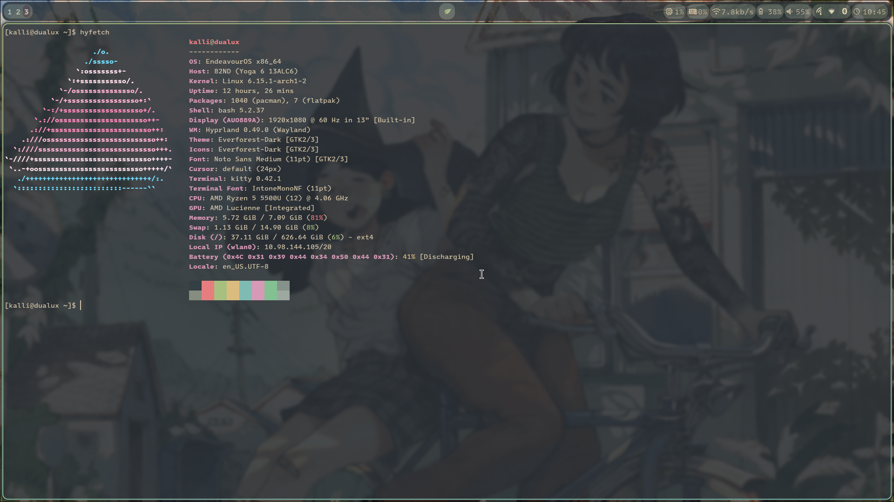

# ChrysanthemumDE

## Overview

Thist is my personal setup for the Hyprland window manager and includes configuration files for all the software I use to make this a fully featured desktop environment.

## Features
- Tiling window manager with Hyprland
- Custom keybinds via Hyprland
- Transparent terminal with the kitty terminal emulator
- Notifications via mako
- Status bar with waybar
- Wallpapers managed by hyprpaper
- ***WIP***: Touch and tablet mode support
- Vim as the primary editor within the cli

## Screenshot

## Installation
***WIP***: Installation script to come

## Dependencies
- hyprland
- waybar
- kitty
- mako
- vim
- hyprpaper
- hyprpolkit
- blueman
- nm-applet
- hyprland-polkit-agent
- wofi
- hyprshot
- hyprlock
- hypridle

## Credits
- [sainnhe's everforest theme](https://github.com/sainnhe/everforest)
- [hyprland-wiki](https://wiki.hyprland.org)
- [SimzArt](https://linktr.ee/simz.art)
